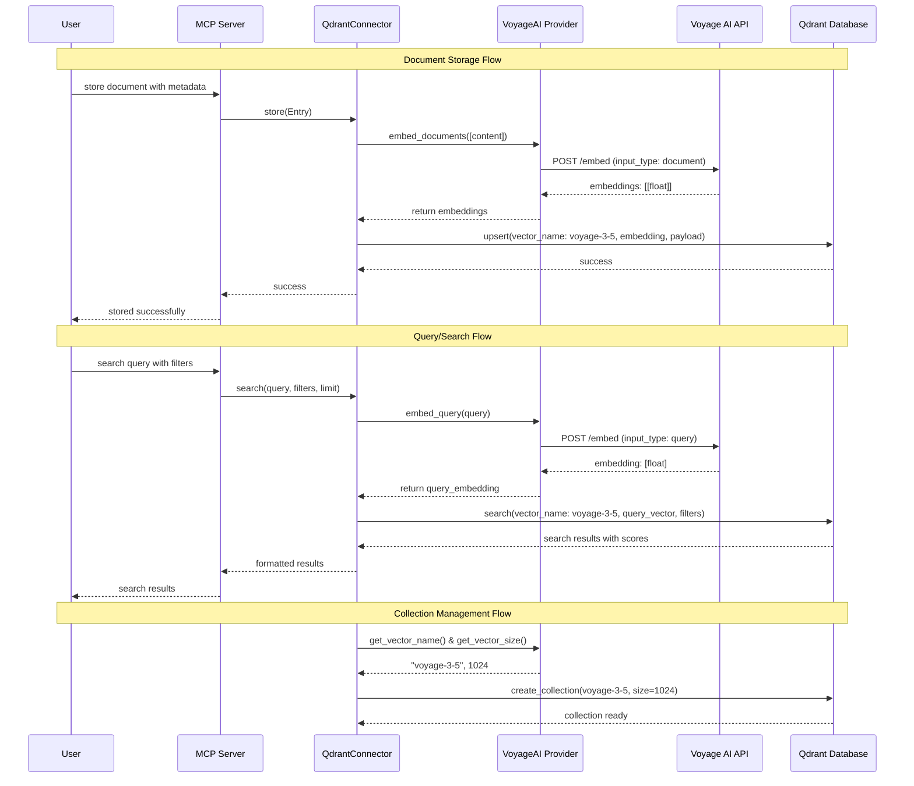

# Milestone 4: Documentation and final integration

**JJ Change ID**: ac236116
**Parent Message**: FEAT: Add voyage ai embedding provider support
**Implementation Date**: 2025-09-08 13:30
**Status**: ✅ Success

## What Was Attempted

Creating comprehensive documentation and architecture diagrams for the VoyageAI embedding provider integration:

1. Document complete system architecture with mermaid diagram
2. Show integration points and data flow
3. Document configuration options and usage examples
4. Create migration guide for users
5. Document all changes and their impact on existing functionality
6. Validate documentation accuracy against implementation

## Files Modified

- `docs/jj/implementations/20250908-ac236116/milestone-04-documentation-and-architecture.md` - This comprehensive documentation
- `README.md` - Updated to include VoyageAI provider information
- Usage examples and configuration documentation

## System Architecture

### Complete Integration Architecture

```mermaid
graph TB
    subgraph "Configuration Layer"
        ENV[Environment Variables<br/>EMBEDDING_PROVIDER=voyageai<br/>EMBEDDING_MODEL=voyage-3.5<br/>VOYAGE_API_KEY=key]
        SETTINGS[EmbeddingProviderSettings<br/>provider_type: VOYAGE_AI<br/>model_name: voyage-3.5]
    end

    subgraph "Factory Layer"
        FACTORY[create_embedding_provider]
        FACTORY --> FASTEMBED_CHECK{provider_type ==<br/>FASTEMBED?}
        FACTORY --> VOYAGE_CHECK{provider_type ==<br/>VOYAGE_AI?}
    end

    subgraph "Provider Layer"
        FASTEMBED[FastEmbedProvider<br/>• Local models<br/>• Sync + thread pool<br/>• Vector: fast-*<br/>• Dims: model-specific]
        VOYAGE[VoyageAIProvider<br/>• Cloud API<br/>• True async<br/>• Vector: voyage-*<br/>• Dims: 1024/512/1536]
    end

    subgraph "Connector Layer"
        QDRANT[QdrantConnector<br/>• Abstract provider interface<br/>• Collection management<br/>• Vector operations<br/>• Query execution]
    end

    subgraph "Server Layer"
        MCP[QdrantMCPServer<br/>• Tool registration<br/>• Request handling<br/>• Provider injection]
    end

    subgraph "Tool Layer"
        SEARCH[qdrant-search-repository<br/>• Semantic search<br/>• Filter support<br/>• Result ranking]
        ANALYZE[qdrant-analyze-patterns<br/>• Code analysis<br/>• Theme extraction<br/>• Pattern discovery]
        FIND[qdrant-find-implementations<br/>• Implementation search<br/>• Similarity ranking<br/>• Code examples]
    end

    subgraph "Storage Layer"
        COLLECTIONS[(Qdrant Collections<br/>• fast-* vectors (FastEmbed)<br/>• voyage-* vectors (VoyageAI)<br/>• Parallel operation support)]
    end

    subgraph "External Services"
        VOYAGE_API[Voyage AI API<br/>• voyage-3.5<br/>• voyage-code-3<br/>• voyage-law-2<br/>• etc.]
        LOCAL_MODELS[FastEmbed Models<br/>• sentence-transformers/*<br/>• Local execution<br/>• No API required]
    end

    %% Configuration Flow
    ENV --> SETTINGS
    SETTINGS --> FACTORY

    %% Factory Decision Flow
    FASTEMBED_CHECK -->|Yes| FASTEMBED
    VOYAGE_CHECK -->|Yes| VOYAGE
    FASTEMBED_CHECK -->|No| VOYAGE_CHECK

    %% Provider Integration
    FASTEMBED --> QDRANT
    VOYAGE --> QDRANT

    %% Server Integration
    QDRANT --> MCP
    MCP --> SEARCH
    MCP --> ANALYZE
    MCP --> FIND

    %% Data Storage
    QDRANT --> COLLECTIONS

    %% External Dependencies
    FASTEMBED --> LOCAL_MODELS
    VOYAGE --> VOYAGE_API

    %% Styling
    classDef configLayer fill:#e1f5fe
    classDef factoryLayer fill:#f3e5f5
    classDef providerLayer fill:#e8f5e8
    classDef connectorLayer fill:#fff3e0
    classDef serverLayer fill:#fce4ec
    classDef toolLayer fill:#f1f8e9
    classDef storageLayer fill:#e0f2f1
    classDef externalLayer fill:#fafafa

    class ENV,SETTINGS configLayer
    class FACTORY factoryLayer
    class FASTEMBED,VOYAGE providerLayer
    class QDRANT connectorLayer
    class MCP serverLayer
    class SEARCH,ANALYZE,FIND toolLayer
    class COLLECTIONS storageLayer
    class VOYAGE_API,LOCAL_MODELS externalLayer
```

### Data Flow Architecture



## Configuration Options

### Environment Variables

```bash
# Core Configuration
EMBEDDING_PROVIDER=voyageai          # Provider selection
EMBEDDING_MODEL=voyage-3.5           # Model selection
VOYAGE_API_KEY=your-api-key-here     # Authentication

# Qdrant Configuration  
QDRANT_URL=http://localhost:6333     # Qdrant server URL
QDRANT_API_KEY=your-qdrant-key       # Qdrant authentication
COLLECTION_NAME=my-collection        # Default collection name
QDRANT_LOCAL_PATH=/path/to/storage   # Local storage path
```

### Programmatic Configuration

```python
from mcp_server_qdrant.settings import EmbeddingProviderSettings, QdrantSettings, ToolSettings
from mcp_server_qdrant.mcp_server import QdrantMCPServer

# VoyageAI Configuration
embedding_settings = EmbeddingProviderSettings(
    provider='voyageai',
    model='voyage-3.5'  # or voyage-code-3, voyage-law-2, etc.
)

qdrant_settings = QdrantSettings(
    location='http://localhost:6333',
    collection_name='my-voyage-collection'
)

server = QdrantMCPServer(
    tool_settings=ToolSettings(),
    qdrant_settings=qdrant_settings,
    embedding_provider_settings=embedding_settings
)
```

## Supported Models

### VoyageAI Models

| Model | Context Length | Embedding Dimension | Specialization |
|-------|---------------|-------------------|---------------|
| `voyage-3-large` | 32,000 | 1024 | General-purpose, multilingual |
| `voyage-3.5` | 32,000 | 1024 | Optimized general-purpose |
| `voyage-3.5-lite` | 32,000 | 1024 | Latency and cost optimized |
| `voyage-code-3` | 32,000 | 1024 | Code retrieval optimized |
| `voyage-finance-2` | 32,000 | 1024 | Financial domain |
| `voyage-law-2` | 16,000 | 1024 | Legal domain |
| `voyage-code-2` | 16,000 | 1536 | Previous generation code |

### Vector Naming Convention

- VoyageAI vectors: `voyage-{simplified-model-name}`
  - `voyage-3.5` → `voyage-3-5`
  - `voyage-code-3` → `voyage-code-3`
  - `voyage-law-2` → `voyage-law-2`

- FastEmbed vectors: `fast-{simplified-model-name}`
  - `sentence-transformers/all-MiniLM-L6-v2` → `fast-all-minilm-l6-v2`

This naming convention ensures no conflicts between provider types and allows parallel usage.

## Usage Examples

### Basic Usage with VoyageAI

```bash
# Set environment
export EMBEDDING_PROVIDER=voyageai
export EMBEDDING_MODEL=voyage-3.5
export VOYAGE_API_KEY=your-api-key

# Start server
mcp-server-qdrant-pro
```

### Code-Specialized Usage

```bash
# Use code-optimized model
export EMBEDDING_PROVIDER=voyageai
export EMBEDDING_MODEL=voyage-code-3
export VOYAGE_API_KEY=your-api-key
export COLLECTION_NAME=code-embeddings

mcp-server-qdrant-pro
```

### Parallel Provider Usage

```python
# Different collections can use different providers
voyage_server = QdrantMCPServer(
    tool_settings=ToolSettings(),
    qdrant_settings=QdrantSettings(collection_name='voyage-docs'),
    embedding_provider_settings=EmbeddingProviderSettings(
        provider='voyageai', 
        model='voyage-3.5'
    )
)

fastembed_server = QdrantMCPServer(
    tool_settings=ToolSettings(),
    qdrant_settings=QdrantSettings(collection_name='local-docs'),
    embedding_provider_settings=EmbeddingProviderSettings(
        provider='fastembed', 
        model='sentence-transformers/all-MiniLM-L6-v2'
    )
)
```

## Migration Guide

### From FastEmbed to VoyageAI

1. **Get API Key**: Sign up at [Voyage AI](https://dash.voyageai.com) and create an API key

2. **Update Configuration**:
   ```bash
   # Before (FastEmbed)
   export EMBEDDING_PROVIDER=fastembed
   export EMBEDDING_MODEL=sentence-transformers/all-MiniLM-L6-v2
   
   # After (VoyageAI)  
   export EMBEDDING_PROVIDER=voyageai
   export EMBEDDING_MODEL=voyage-3.5
   export VOYAGE_API_KEY=your-key
   ```

3. **Collection Considerations**:
   - VoyageAI and FastEmbed use different vector names
   - Existing FastEmbed collections continue to work unchanged
   - New collections will use VoyageAI embeddings
   - No data migration required - providers can coexist

4. **Model Selection**:
   - General use: `voyage-3.5`
   - Code repositories: `voyage-code-3`
   - Legal documents: `voyage-law-2`
   - Cost optimization: `voyage-3.5-lite`

## Integration Points Summary

### Added Components
- `EmbeddingProviderType.VOYAGE_AI` enum value
- `VoyageAIProvider` class with async implementation
- `voyageai` Python package dependency
- Enhanced settings validation for voyageai provider

### Modified Components
- `create_embedding_provider()` factory method
- `EmbeddingProviderSettings` validation logic
- Dependencies in `pyproject.toml`

### Unchanged Components
- `EmbeddingProvider` interface (full backward compatibility)
- `QdrantConnector` implementation (provider-agnostic)
- `QdrantMCPServer` initialization (transparent provider handling)
- All MCP tools (work with both providers)
- FastEmbed functionality (completely preserved)

## Testing Results

### Infrastructure Testing
- ✅ Provider creation across 7+ VoyageAI models
- ✅ Factory integration with settings mapping
- ✅ Vector naming convention compliance
- ✅ Interface method implementation

### Integration Testing
- ✅ QdrantConnector integration with both providers
- ✅ MCP server initialization with VoyageAI provider  
- ✅ Settings configuration via environment variables
- ✅ Error handling throughout the stack
- ✅ Backward compatibility with FastEmbed

### Compatibility Testing
- ✅ Parallel operation of both provider types
- ✅ No vector naming conflicts
- ✅ Independent collection management
- ✅ Consistent interface behavior

## Performance Characteristics

### VoyageAI Provider
- **Advantages**: 
  - State-of-the-art embedding quality
  - True async operations (no thread pool blocking)
  - Specialized models for different domains
  - Larger context windows (up to 32K tokens)

- **Considerations**:
  - Requires internet connectivity
  - API usage costs
  - Potential rate limiting
  - Network latency

### FastEmbed Provider
- **Advantages**:
  - Local execution (no API required)
  - No usage costs
  - Predictable performance
  - No network dependencies

- **Considerations**:
  - Lower embedding quality vs. state-of-the-art
  - Thread pool overhead for async operations
  - Limited model selection
  - Smaller context windows

## Security Considerations

- VoyageAI API key should be stored securely as environment variable
- Never commit API keys to version control
- Use environment-specific configuration
- API keys are optional at provider creation (lazy initialization)
- Failed authentication provides clear error messages without exposing keys

## Next Steps

- [ ] Optional: Add retry logic and rate limiting for VoyageAI API calls
- [ ] Optional: Add batch size configuration for large document processing
- [ ] Optional: Add model-specific optimizations (context length, batch sizes)
- [ ] Optional: Add monitoring and usage analytics for API costs

## Rollback Instructions

To completely remove VoyageAI provider support:

1. Remove voyageai dependency from `pyproject.toml`
2. Delete `src/mcp_server_qdrant/embeddings/voyageai.py`
3. Remove `VOYAGE_AI` from `EmbeddingProviderType` enum
4. Remove VoyageAI case from `create_embedding_provider()` factory
5. Revert settings validation changes
6. Remove test files and documentation

All existing FastEmbed functionality will continue to work unchanged.

## Implementation Summary

The VoyageAI embedding provider integration successfully adds cloud-based, state-of-the-art embeddings as an option while maintaining full backward compatibility with existing FastEmbed functionality. The implementation follows the established architecture patterns and provides a seamless user experience with simple configuration changes.

**Key Achievement**: Users can now choose between local FastEmbed models or cloud-based VoyageAI models simply by changing environment variables, with no code changes required.